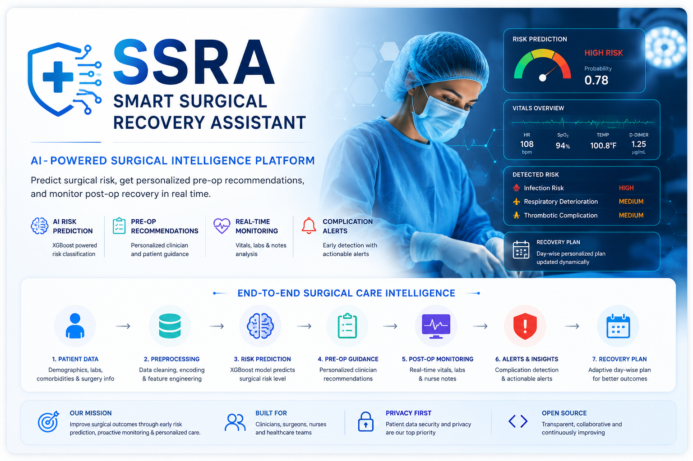

  

# 🏥 Smart Surgical Recovery Assistant (SSRA)

> **AI-powered surgical risk prediction and personalized post-operative recovery monitoring system**
🏥 Smart Surgical Recovery Assistant (SSRA)

AI-powered surgical risk prediction and personalized post-operative recovery monitoring system

SSRA (Smart Surgical Recovery Assistant) is a healthcare AI system designed to assist clinicians in predicting surgical risk, generating personalized pre-operative recommendations, and monitoring post-operative complications in real time.

The system combines machine learning, clinical decision support, rule-based medical intelligence, and monitoring workflows to improve surgical outcomes and patient recovery.

⸻

🚀 Key Features

1️⃣ Surgical Risk Prediction

* Predicts post-operative surgical risk levels
* Classifies patients into:
    * Low Risk
    * Moderate Risk
    * High Risk
* Uses XGBoost-based predictive modeling

2️⃣ Personalized Pre-Operative Recommendations

Generates customized recommendations based on:

* Patient demographics
* Comorbidities
* Surgical type
* Risk level
* Clinical knowledge base

Provides:

✅ Clinician recommendations
✅ Patient preparation checklist
✅ Risk-aware interventions

3️⃣ Real-Time Post-Operative Monitoring

Monitors:

* Heart rate (HR)
* Temperature
* SpO₂
* D-dimer trends
* Nurse notes / clinical text

Detects potential complications such as:

* Infection risk
* Respiratory deterioration
* Thrombotic complications
* Abnormal recovery patterns

4️⃣ Intelligent Recovery Plan Updates

Dynamically updates:

* Recovery recommendations
* Monitoring priorities
* Clinical alerts
* Day-wise recovery plans

5️⃣ Patient Dashboard

Includes:

* Patient history tracking
* Event monitoring
* Recovery timeline
* JSON-based patient record storage

⸻

🧠 System Architecture
Patient Data
(age, BMI, vitals, surgery type)
            ↓
Preprocessing Pipeline
            ↓
ML Risk Prediction Model (XGBoost)
            ↓
Pre-Operative Recommendation Engine
            ↓
Real-Time Post-Op Monitoring
            ↓
Complication Detection & Alerts
            ↓
Adaptive Recovery Plan

🛠️ Tech Stack
Programming	- Python
Machine Learning -	"XGBoost, Scikit-Learn"
Frontend -	Streamlit
Data Processing	- "Pandas, NumPy"
Model Serialization	- Joblib
Clinical Knowledge Base	- JSON
Monitoring - Rule-based clinical detection

📂 Repository Structure
SSRA/
├── assets/                  # Images, diagrams, screenshots
├── data/
│   └── knowledge_base.json
│
├── docs/                    # Documentation
│
├── models/
│   ├── ssra_preprocessor.pkl
│   ├── ssra_xgb_model.pkl
│   └── ssra_xgboost_model.pkl
│
├── notebooks/
│   └── ssra_model_development.ipynb
│
├── results/                 # Outputs and evaluation
│
├── src/
│   ├── app.py
│   ├── postop_monitoring.py
│   └── preop_recommender.py
│
├── requirements.txt
└── README.md

⚙️ Installation

Clone the repository:
git clone https://github.com/Tanishakumar26/SSRA.git
cd SSRA

Install dependencies:
pip install -r requirements.txt

Run the application:
streamlit run src/app.py

📊 Model Workflow
1. Patient data collection
2. Data preprocessing
3. Surgical risk prediction
4. Personalized recommendation generation
5. Post-operative monitoring
6. Complication detection
7. Recovery plan updates

🎯 Clinical Impact
SSRA aims to improve surgical outcomes through:

* Early complication detection
* Personalized patient care
* Risk-aware intervention planning
* Better post-operative monitoring
* Clinical decision support augmentation

🔮 Future Enhancements
* Explainable AI using SHAP
* Electronic Health Record (EHR) integration
* Real-time wearable device monitoring
* Deep learning–based clinical prediction
* Cloud deployment for hospital systems
* Multi-hospital scalability

🎯 Clinical Impact

SSRA aims to improve surgical outcomes through:

* Early complication detection
* Personalized patient care
* Risk-aware intervention planning
* Better post-operative monitoring
* Clinical decision support augmentation

👩‍💻 Author
Tanisha Kumar
B.Tech CSE (AI & ML)

Interested in:
Healthcare AI • Machine Learning • Clinical Decision Support • Applied AI Research

📜 License
This project is developed for research and educational purposes.
